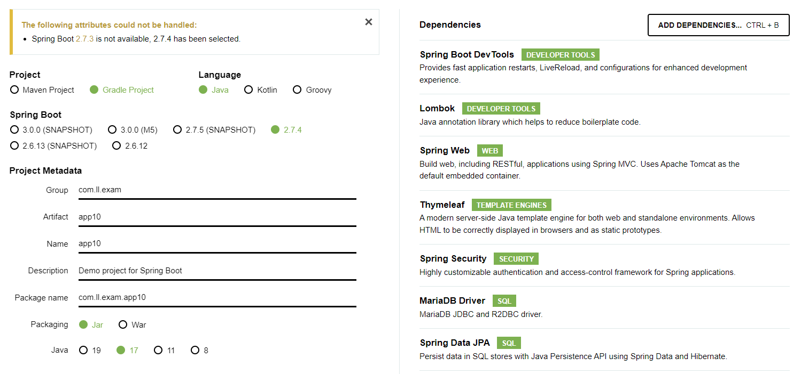
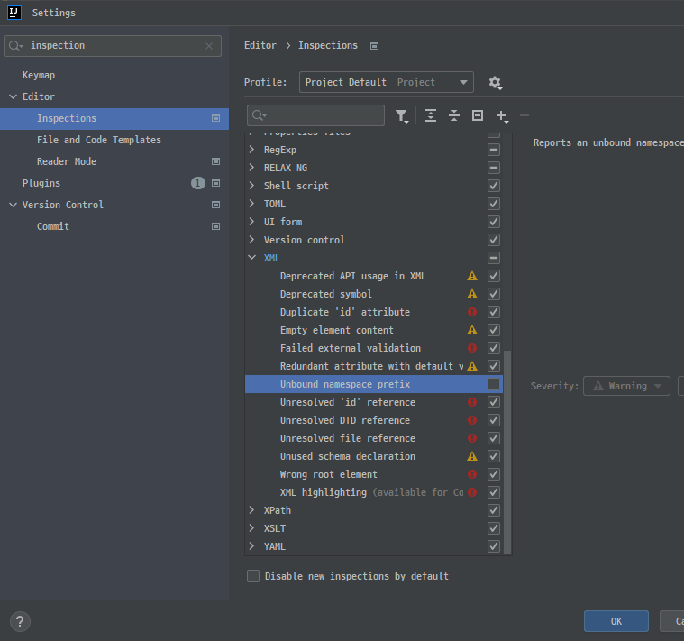
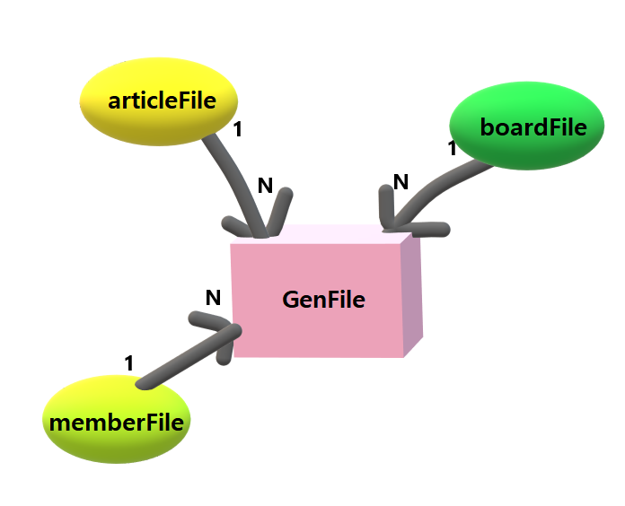
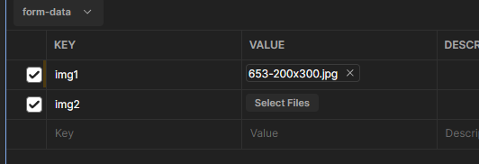

# 🏷️스프링부트 - 파일업로드, 소셜로그인, 해시태그

### 🔻 프로젝트 세팅

 

### 🔻 학습내용
* GenFile 하나로 모든 파일정보를 다룬다.

* 파일을 보내는 방법
    - 한번에 다 보내는 방법
    - 2번에 나눠 보내는 방법:  1) 파일들부터 모두 업로드  2) 응답(번호, 번호) ,  3) 폼에 집어넣음 4) 폼 발송(파일들을 빼고 업로드)
       

* 파일업로드는 method="POST" enctype="multipart/form-data"가 필수이다. (GET X)

 

* 일반 웹브라우저
  - GET
  - POST

 

* POSTMAN 일종의 브라우저 (웹개발 할 때 많이 사용되는 편리한 툴)
  - GET
  - POST
  - PATCH

