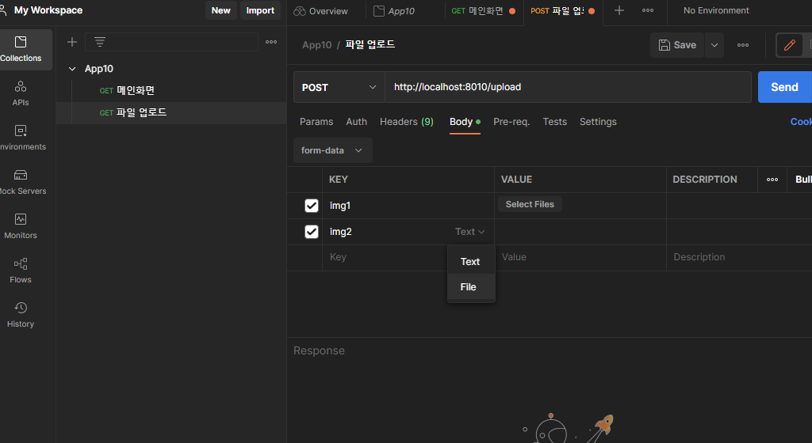

# 🏷️스프링부트 - 파일업로드, 소셜로그인, 해시태그

### 🔻 프로젝트 세팅

<br>


### 🔻 학습내용
* GenFile 하나로 모든 파일정보를 다룬다.


* 파일을 보내는 방법
    - 한번에 다 보내는 방법
    - 2번에 나눠 보내는 방법:  1) 파일들부터 모두 업로드  2) 응답(번호, 번호) ,  3) 폼에 집어넣음 4) 폼 발송(파일들을 빼고 업로드)
       

* 파일업로드는 method="POST" enctype="multipart/form-data"가 필수이다. (GET X)

<br>

* 일반 웹브라우저
  - GET
  - POST

<br>

* POSTMAN 일종의 브라우저 (웹개발 할 때 많이 사용되는 편리한 툴)
  - GET
  - POST
  - PATCH




* memberContext를 세션에 저장하는 이유는 db쿼리 많이 안날라가게 하기 위해서이다.

<hr>

### <오류해결>

1. 카카오로그인을 위한 의존성 추가, 설정시 오류


```
Caused by: org.springframework.beans.factory.BeanCreationException: 
Error creating bean with name 'filterChain' defined in class path resource 
[com/ll/exam/app10/app/security/SecurityConfig.class]: Bean instantiation via factory method failed; 
nested exception is org.springframework.beans.BeanInstantiationException: 
Failed to instantiate [org.springframework.security.web.SecurityFilterChain]: 
Factory method 'filterChain' threw exception; nested exception is org.springframework.beans.factory.BeanCreationException: 
Error creating bean with name 'clientRegistrationRepository' defined in class path resource 
[org/springframework/boot/autoconfigure/security/oauth2/client/servlet/OAuth2ClientRegistrationRepositoryConfiguration.class]: 
Bean instantiation via factory method failed; nested exception is org.springframework.beans.BeanInstantiationException: 
Failed to instantiate [org.springframework.security.oauth2.client.registration.InMemoryClientRegistrationRepository]: 
Factory method 'clientRegistrationRepository' threw exception; nested exception is java.lang.IllegalStateException: 
Provider ID must be specified for client registration 'kakao'
```

<br>
✅ 오류해결 => application.yml의 clientId에 아무거나 씀. ==> 이후 지우고 다시 실행했더니 다시 됨..?